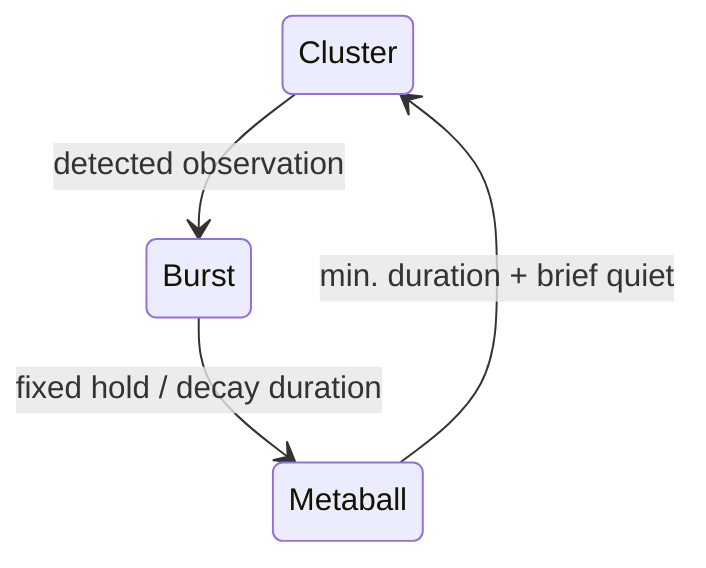
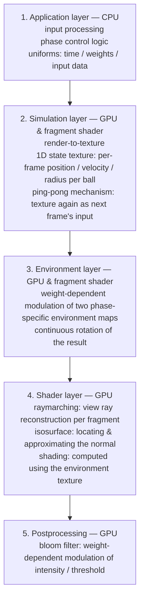

# T-1003

## 1. Functionality

### 1.1 Concept

The application models an abstract, non-anthropomorphic creature, to prompt reflection on whether and how observers interpret human behavioral and emotional patterns into purely artificial constructs.

Central mechanism: *observation changes the observed.*

A creature at rest startles as soon as it believes itself observed, dissolves abruptly into agitation, and calms down again only after some time.

The virtual environment frames the creature as a strange specimen trapped in its habitat, producing a back-and-forth of safety and unease toward its otherness.

Aesthetic reference for the reflective, morphing surface: the T-1000.

### 1.2 Interaction

**Events:**
- detected observation / eye contact by a person in front of the camera
- ending the resting state / triggering the startle moment

**Modulation:**
- ambient motion: affects intensity / speed during the agitated phase
- independent of the trigger itself

**Webcam as input device:**
- presence detection / gaze-direction detection
- motion energy computed from frame differences

**Scene camera:**
- camera of the 3D scene
- static, no user control

### 1.3 Phase system

**Recurring cycle:**



| Phase | Meaning | Trigger for next phase |
|---|---|---|
| **Metaball** | agitation: loose orbiting of the metallic, reflective parts | continuation via observation; decay after minimum duration + brief quiet |
| **Cluster** | equilibrium: merger into a single, glass-like transparent, static body | detected observation |
| **Burst** | startle: explosive repulsion of the parts from their shared center of mass | fixed hold duration / decay duration |

**No abrupt jump between phases:** continuous cross-blend of shape / shading / environment / motion / audio at every point in time

**No cooldown:** immediate triggering of a new cycle by renewed observation, at any time

### 1.4 Object representation

**Forms of the object:**
- **variants:**
  - $n$ metaballs
  - geometric body

**Metaball surface:**
- **data:** $i$: index, $\mathbf{c}_i(t)$: position, $r_i(t)$: radius
- **combined SDF** of the whole object via smoothing function $\text{smin}_k$:

$$S_M(\mathbf{x},t)=\text{smin}_k\;\bigl(\|\mathbf{x}-\mathbf{c}_i(t)\|-r_i(t)\bigr),\quad i=1,\dots,n$$

**Geometric body in the cluster state:**
- **combined SDF** $S_K$ from a set of prebuilt, closed base shapes
- random selection at each phase entry

**Pseudo-random noise function:**

$$\mathcal{N}(\mathbf{x},t)$$

- additive perturbation of the combined SDF, producing an organic, not-perfectly-smooth surface:

$$\hat S_M(\mathbf{x},t)=S_M(\mathbf{x},t)+\beta\cdot\mathcal{N}(\mathbf{x},t)$$

- additive modulation of each ball's radius, independent of the surface perturbation, uncoupled from that ball's visibility within the ball union:

$$r_i(t) = r_i^0+\alpha\cdot\mathcal{N}(\mathbf{c}_i(t),t)$$

### 1.5 Weighting of the phases

**Weighting function:** unnormalized Gaussian kernel per phase $p\in\{\text{Metaball, Cluster, Burst}\}$

$$\mathcal{G}_p(t\mid\mu_p(t),\sigma_p^2)$$

**Normalized weights:**

$$\hat w_p(t)=\frac{\mathcal{G}_p(t\mid\mu_p,\sigma_p^2)}{\sum_{q}\mathcal{G}_q(t\mid\mu_q,\sigma_q^2)}$$

**Principle:** identical phase weights for every attribute

**Phase-dependent attribute function $a_p$:** effective value as a convex combination

$$a(\xi,t)=\sum_p \hat w_p(t)\cdot a_p(\xi,t)$$

**Parameters:**
- $\sigma_p^2$: softness of the phase transition
- $\mu_p(t)$: time of the phase transition
  - $\mu_p=t$: immediate onset
  - $\mu_p=t+l\cdot\sigma_p$: delayed onset

### 1.6 Motion per phase

1. **Metaball:**
    - **orbital motion:** movement along a fixed, inclined orbit around the scene center
    - **orbit parameters:** $\rho_i$: orbit radius, $\nu_i$: orbit inclination, $\varsigma_z$: global $z$-squash, $\varphi(t)$: angle along the orbit

    $$\mathbf{q}_i(\varphi(t)) = \rho_i\begin{pmatrix}
      \cos\varphi(t)\\
      \sin\varphi(t)\sin\nu_i\\
      \varsigma_z\cdot\sin\varphi(t)\cos\nu_i
    \end{pmatrix}$$

    - **orbit properties:** random initial angle on each orbit; incommensurable orbit speeds — motion pattern never exactly repeats
    - additional modulation of angular speed by detected motion energy
2. **Cluster:**
    - **origin pull:** gentle pull toward the scene origin

    $$\mathbf{v}_i\propto \mathbf{o}-\mathbf{c}_i$$

    - merger into a single body
3. **Burst:**
    - **repulsion:** acceleration away from the shared center of mass

    $$\hat{\mathbf{c}}(t)=\frac1n\sum_i\mathbf{c}_i(t)$$

    $$\mathbf{v}_i\propto \mathbf{c}_i-\hat{\mathbf{c}}$$

    - **force scaling:** strength dependent on motion energy

### 1.7 Audio

**Sound layers:** phase-coupled, looping
- **Cluster:** calm / low-frequency
- **Burst:** bang / explosion
- **Metaball:** high-frequency / alien-like

### 1.8 Robustness

**Best effort:** camera, microphone & resource access
- denied permissions or missing files: warning, no error
- possibly permanent stay in the cluster state

**Hysteresis:**
- confirmation of observation detection across several frames
- avoids flicker from single misdetections

## 2. Implementation

### 2.1 Pipeline

**Technological base:** browser-based WebGL application with Three.js as the rendering framework

**Five layers, pass order per frame:**



**Ball state & environment map:** entirely on the GPU, no per-frame roundtrip to the CPU

**Input data flow:**
- **application layer:** processing of the webcam's raw data
- **shader:** uses only derived, already-weighted state quantities

**No build step:** application as a collection of ES modules
- three.js loaded via `importmap` from a CDN
- local web server, no `file://`

### 2.2 Rendering technique

- **implicit definition** of the object via signed distance fields
- **rendering** via raymarching
- **no explicit mesh geometry** besides a screen-filling quad

### 2.3 Module contract

**`getUniformDefinitions()` / `applyStateToMaterial()`:**
- full uniform ownership by every module that supplies state to the central shader
- **usage:**
  - definitions: distributed once by `main.js` at material setup
  - state application: `applyStateToMaterial` call every frame
  - no direct access

```js
export function getUniformDefinitions() { return { name: { value: ... }, ... }; }
export function applyStateToMaterial(material) { material.uniforms.name.value = ...; }
```

### 2.4 Central state management

**`phase.js` as central FSM & implicit event bus:**
- **singleton:**
  - module-level mutable state: direct import
  - no dependency injection from `main.js`
- **top-level `animate()` loop:** avoids prop-drilling as phase-state consumers grow
- **cost:** implicit global coupling
  - read access by every module to shared state
  - reset required for tests (`vi.resetModules()` per test)

### 2.5 GPU infrastructure

**Fullscreen-quad factory:**
- fullscreen-quad pass: `initializeGpuSetup(material)` from `gpuSetup.js`
- **consistency of render-target types:**
  - `THREE.FloatType` for simulation state
  - `THREE.HalfFloatType` for postprocessing

**Ping-pong render targets:**
- **GPU-resident state across frames:**
  - two `WebGLRenderTarget`s
  - swap every frame

### 2.6 Shader composition

**GLSL chunk injection:**
- export of template strings: chunk files inserted into the enclosing shader via `${chunk}`
- prerequisite: enclosing shader's uniform declarations & helper functions in scope
- no top-level `const` name collisions: chunks combined into **one** GLSL compilation unit
- string export: no chunk factory function with assembly-time parameters

**Shared constants:**
- `src/constants.js`: single source for constants used in **more than one** file
- JS module: direct import
- **GLSL chunk / shader:** interpolated into template-literal source (`` const int BALL_COUNT = ${BALL_COUNT}; ``)
  - number interpolation in `float` context via `glslFloat(n)`
  - explicit decimal point on `float` literals
- constants used only once: kept local
